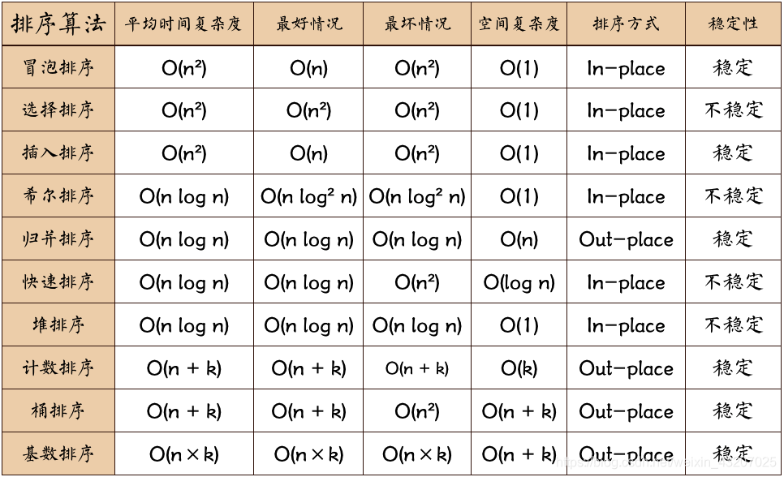

## 排序算法及其时间复杂度

1.衡量一个排序算法的标准：时间复杂度、空间复杂度、稳定性【即排序完成后，值相等的的数不发生位置变化，则稳定行高】
```text
稳定：如果a原本在b前面，而a=b，排序之后a仍然在b的前面；    eg: a=b=5  8,3,2,a,b,9  ->  2,3,a,b,8,9
不稳定：如果a原本在b的前面，而a=b，排序之后a可能会出现在b的后面；  eg: a=b=5  8,3,2,a,b,9  ->  2,3,a,b,8,9 or 2,3,b,a,8,9
内排序：所有排序操作都在内存中完成；
外排序：由于数据太大，因此把数据放在磁盘中，而排序通过磁盘和内存的数据传输才能进行；
时间复杂度： 一个算法执行所耗费的时间。
空间复杂度：运行完一个程序所需内存的大小。
```


图片名词解释：
```
n: 数据规模
k: “桶”的个数
In-place: 占用常数内存，不占用额外内存
Out-place: 占用额外内存
```
2.排序动图：https://www.cnblogs.com/onepixel/articles/7674659.html

### 极客时间 第11节：为什么插入排序比冒泡排序更受欢迎？
第一组：冒泡排序、插入排序、选择排序
```text
概念：原地排序（Sorted in place）。原地排序算法，就是特指空间复杂度是 O(1) 的排序算法
时间复杂度：O(n^2)，比较适合小规模数据排序
```

### 极客时间 第12节：排序（下）如何用快排思想在O(n)内查找第K大元素？
第二组：归并排序和快速排序
```text
时间复杂度：O(nlogn)，比较适合大规模数据排序
归并排序：分解--合并，分治思想，适合用递归
归并排序的处理过程是由下到上的，先处理子问题，然后再合并。
而快排正好相反，它的处理过程是由上到下的，先分区，然后再处理子问题
```
